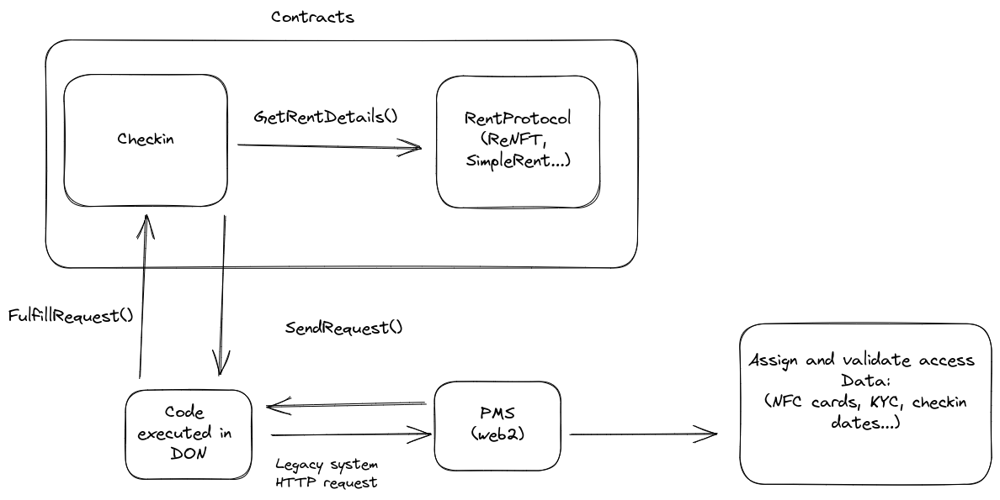

# Propytech

Opportunity: There are already solutions that do the heavy lifting of renting NFTs (such as [ReNFT protocol](https://www.renft.io/)). They abstract the complexity of handling rentals of non-fungible tokens on-chain. By building on top of the rental infrastructure of ReNFT, In this project we wanted to solve the problem of renting real estate via smart contracts, while keeping the legacy tech components and compliance of the rental tied to the blockchain.

Our idea: a real estate renting platform, with a front-end UX that is familiar to most people that rented on AirBNB, but renting the property is done on the smart contract while the KYC verification, attestation of NFC cards to unlock doors, and other post check-in rules are handled off-chain in the renter system. All in a easy way to tie on-chain and off-chain systems.

## What it does

TLDR: Rent the real estate on-chain while the Property Management System (PMS) off-chain can be triggered by the "checkin" smart contract using a Chainlink Function to verify user data before check-in, assign physical NFC keys to open the doors and so on.

Using the front-end, users are able to rent paying in cryptocurrency and to check-in after the payment is done. The check-in calls a Chainlink Function to interact
with the off-chain PMS. Notice that the PMS being able to be synced with the contract means that the same property could be rented both in legacy systems and smart contracts, without ending up in a "duplicate buy" scenario, since 

## Challenges we ran into

- Creating and integrating to lending protocols is hard. Even though ReNFT does most of the heavy lifting, we wanted to create
the protocol in a way that it is not dependent on a specific renting protocol, but rather has interfaces that abstract accordingly.

- Handling Chainlink functions has a lot of steps. Thankfully, the [Chainlink functions starter kit](https://github.com/smartcontractkit/functions-hardhat-starter-kit) is useful for handling it all in a testnet. However, we found it was hard to integrate test scripts in it. 

## How we built it

Our tech stack went as follows:

- Nextjs, with postgres databse (acts as both the front-end and back-end)
- Chainlink Function
- Solidity Smart contracts

### Smart contracts

The most important contracts we developed were:

- `SimpleRent.sol`: Handles the renting logic. It's non custodial lending, so NFTs are owned by the `SimpleRent` contract and it marks the renter and the lender 
for the usage in the checkin contract.
- `SimpleRentCheckin.sol`: A contract that inherits the Chainlink Functions Consumer capabilities, to handle the off-chain checkin process and mark it's results onchain

### Chainlink functions

The smart contract `SimpleRentCheckin.sol` calls the checkin off-chain functions, which by itself can be used to call another API that is the legacy system
being communicated to. There is a general script in `contracts/functions-examples/checkin-example.js` that gives the general logic. Simply put, it uses the
`orderId` of the rental protocol being used and returns an status representing that either the checkin was approved or not.

### Frontend and Backend

A nextjs app that connects to a Postgres instance using Prisma, essentially representing some legacy (web2) system that could be integrated with smart contracts. 

To have a higher level understanding of how it works, check the following diagram:

## Accomplishments that we're proud of

In the `/contracts` folder, there are many scripts available and a full documentation on running the tests. There is also notably a `test.sh` script that does
all the process of setting everything up in a local testnet, for debugging. This script is particularly useful, because it handles automatically a lot of the setup process of a local testnet that Chainlink Functions can answer calls to. Some changes to it could be made to make it as an example for the [Chainlink functions starter kit](https://github.com/smartcontractkit/functions-hardhat-starter-kit) on how to test the integration of contract and off-chain call answers in a single command call. 

## What is next for Propytech

There are many use cases that we did not cover. PMS systems have handle the dates when the renters are coming, besides only the amount of days they are renting
instantiated by the contract `SimpleRent` contract. No hotel or "AirBNB like" application will be able to make business without giving it's users the ability to choose which dates they want to rent instead of simply putting the amount of days they will rent it for. A smart contract would be able to keep the available dates updated on-chain, in a similar fashion to the checkin contract. PMS systems also have many custom checks that they have to do (room is clean? Is time of checkin valid?) that we did not implement. Theoretically, they can all be integrated to their API via a Chainlink Functions Consumer.

We are looking forward into implementing our first rental solution in the real, with the payments being handled by smart contracts while keeping
it synchronized with an off-chain system that handles the property management. Essentially, solving these integration problems of these two techs that seem disconnected.   